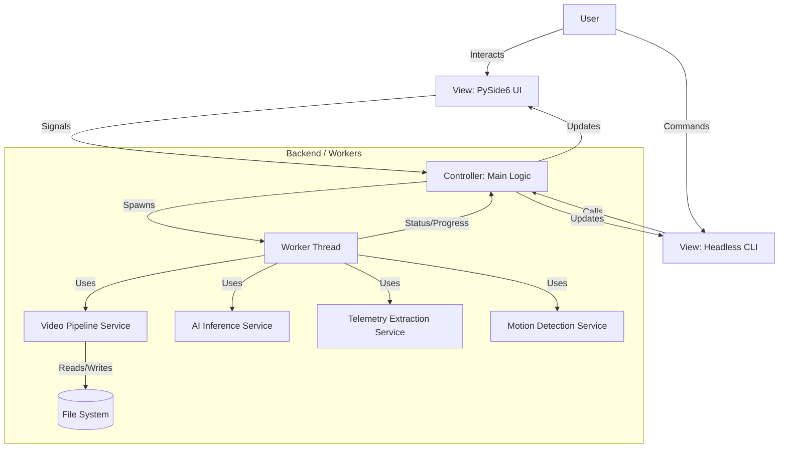
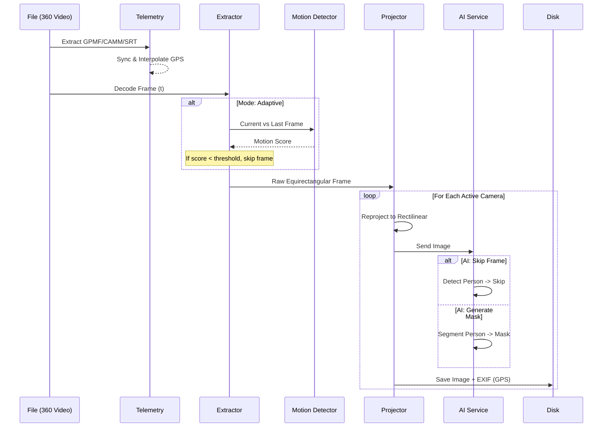

# Software Architecture & Technical Specifications: 360° Video Preprocessor

## 1. Executive Summary
This document outlines the technical design for a high-performance desktop and CLI application dedicated to preprocessing 4K-8K 360° video files. The application prepares datasets for Gaussian Splatting and photogrammetry pipelines (COLMAP, RealityScan) by converting equirectangular footage into optimized, overlap-controlled rectilinear pinhole views, while simultaneously cleaning the data using AI and enriching it with telemetry.

**Key Constraints:**
- **Cross-Platform:** Primary support for macOS (Apple Silicon), portable to Windows 11.
- **Modes:** Dual interface via PySide6 GUI and Headless CLI for cloud/server deployments.
- **Intelligence:** Motion-aware adaptive frame extraction (Optical Flow).
- **Data Enrichment:** Native extraction of GPS/IMU metadata (GoPro, Insta360, DJI).

---

## 2. Technology Stack Selection

### Core Framework: Python 3.10+ & PySide6 (Qt)
**Justification:**
- **Cross-Platform:** Qt offers the most robust cross-platform UI framework.
- **Ecosystem:** Python is the native language of Computer Vision and AI.
- **CLI Robustness:** Leveraging `argparse` for a professional command-line experience.

### Libraries & Dependencies
| Component | Technology | Reasoning |
|-----------|------------|-----------|
| **UI Framework** | **PySide6** | Modern Qt bindings for Python. |
| **Video Processing** | **OpenCV (cv2) + FFmpeg** | Industry standard for decoding/encoding. |
| **Math/Array Ops** | **NumPy** | Essential for vectorized matrix operations. |
| **AI/ML** | **YOLOv8 (Ultralytics)** | State-of-the-art detection and segmentation. |
| **Telemetry** | **piexif + Custom Parsers** | Native GPMF/CAMM parsing and EXIF injection. |
| **Motion Detection** | **OpenCV Farneback** | Dense Optical Flow for adaptive extraction. |
| **Progress Tracking**| **tqdm** | Real-time CLI progress monitoring. |

---

## 3. System Architecture

The application follows a **Model-View-Controller (MVC)** architectural pattern.



### Component Breakdown

#### A. View (UI & CLI Layer)
- **MainWindow:** The primary GUI container with sidebar navigation and stacked pages.
- **Sidebar:** Navigation component for switching between Videos, Settings, Export, and Advanced pages.
- **VideoCard:** Modern card widget displaying video jobs with thumbnails and progress.
- **CollapsibleSection:** Animated expandable sections for organized settings.
- **ToggleSwitch:** Modern animated toggle replacing standard checkboxes.
- **Headless Interface:** Command-line entry point using `argparse`.

#### B. Controller (Logic Layer)
- **AppController:** Manages application state and settings prioritization (CLI > Config > Default).
- **SignalManager:** Routes events (signals) to both GUI widgets and CLI progress bars (`tqdm`).

#### C. Model (Processing Layer)
- **VideoProcessor:** Orchestrates the re-projection loop.
- **MotionDetector:** Implements Farneback Optical Flow to calculate scene change magnitude.
- **TelemetryHandler:** Detects and parses GPMF (GoPro), CAMM (Insta360), and SRT (DJI) metadata.

---

## 4. Video Pipeline & Algorithms

### 4.1. Data Flow



### 4.2. Algorithms

#### Adaptive Interval (Optical Flow)
To minimize redundancy, the application calculates the **Dense Optical Flow** between the current frame and the last extracted frame using the Farneback algorithm on downsampled grayscale versions. 
- **Score:** Mean magnitude of all flow vectors.
- **Decision:** Extraction occurs only when `score > motion_threshold`.

#### Metadata Synchronization
Telemetry samples are extracted as a time-series. For any extracted frame at time $t$, the system performs linear interpolation between the two closest GPS samples $(t_i, t_{i+1})$ to ensure millisecond-accurate EXIF coordinates.

---

## 5. Directory Structure

```text
360Extractor/
├── src/
│   ├── main.py                 # Entry point (GUI/CLI router)
│   ├── ui/                     # GUI Layer (v2.0)
│   │   ├── main_window.py      # Main window with sidebar navigation
│   │   ├── sidebar.py          # Navigation sidebar component
│   │   ├── video_card.py       # Video job card with thumbnail
│   │   ├── toggle_switch.py    # Modern animated toggle
│   │   ├── collapsible_section.py # Expandable settings sections
│   │   ├── preview_widget.py   # Frame preview with blur score
│   │   ├── widgets.py          # Drop zone and utilities
│   │   └── styles.qss          # Modern dark theme stylesheet
│   ├── core/                   # Processing Core
│   │   ├── processor.py        # Extraction Loop
│   │   ├── geometry.py         # Projection Math
│   │   ├── telemetry.py        # GPS/IMU Manager (+ GPX sidecar)
│   │   ├── motion_detector.py  # Optical Flow Logic
│   │   └── ai_model.py         # YOLO Wrapper
│   └── utils/
│       ├── gpmf_parser.py      # Binary GPMF Logic
│       ├── camm_parser.py      # Binary CAMM Logic
│       ├── srt_parser.py       # DJI Metadata Logic
│       └── gpx_parser.py       # GPX Sidecar Parser
├── docs/                       # Protocole & Handbooks
├── requirements.txt
└── ARCHITECTURE.md
```
