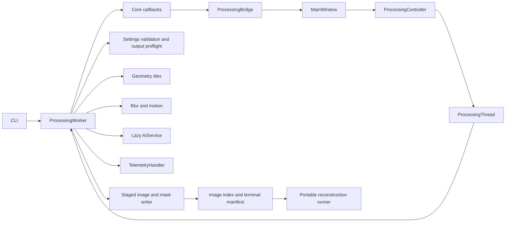

# Application architecture

This document describes the correction branch based on Studio, rather than the obsolete v2 architecture. See [implementation status](docs/implementation-2026-09-07/PROGRESSION.md) for remaining qualification work.

```mermaid
flowchart LR
  CLI[CLI] --> Worker[ProcessingWorker]
  UI[MainWindow] --> Controller[ProcessingController]
  Controller --> Thread[ProcessingThread]
  Thread --> Worker
  Worker --> Events[Core callbacks]
  Events --> Bridge[ProcessingBridge]
  Bridge --> UI
  Worker --> Validation[Settings validation and output preflight]
  Worker --> Projection[Geometry tiles]
  Worker --> Filters[Blur and motion]
  Worker --> AI[Lazy AIService]
  Worker --> GPS[TelemetryHandler]
  Worker --> Writer[Staged image and mask writer]
  Writer --> Index[Image index and terminal manifest]
  Index --> COLMAP[Portable reconstruction runner]
```

## Execution and ownership

`core/processor.py` is Qt-free. The CLI calls `run()` synchronously; Studio owns a `ProcessingController`, which owns a `ProcessingThread` and the worker. `ProcessingBridge` forwards callbacks through Qt signals. Completion of the GUI controller means the thread has terminated, not merely that an image task was submitted.

`stop()` requests cooperative cancellation. The I/O executor drains in `run()`'s `finally`. Projection tiles and metadata subprocesses observe cancellation. The GUI defers closing until active extraction, analysis and preview work ends. Video decoder and model calls may still impose cancellation latency.

Thumbnail work uses a shared pool capped at four jobs and returns QImage. Preview has its own single-worker pool and invalidates stale generations. GUI-only QPixmap creation stays in the GUI thread. Blur analysis owns a QThread and records the identity of the analyzed job.

## Settings and output contract

`validation.py` merges defaults and checks types, ranges, enums, active views, AI targets, model trust and a projection memory budget. `output_plan.py` discovers and deduplicates input files, excludes prior datasets and validates output names. Every run gets a new `_processed`, `_processed_001`, … folder. Replacing or resuming an existing run is deliberately not yet implemented.

`FileManager.write_pair` stages complete image/mask files before publishing them. Failed writes raise, all futures are inspected, and counters count confirmed writes. `images.jsonl` lists successful images with camera/frame associations. Manifest schema 2 starts in running state and records terminal state, output folder, counts, errors and run identity. It distinguishes source size/mtime identification from cryptographic verification; a source hash is not yet calculated. Publishing two files is not a power-loss-atomic transaction; a process kill can leave partial files/index data and a running manifest.

## Image and model pipeline

Geometry uses float64 ray tiles and float32 remapping tables. Preview and export use the same generated view definitions, fixed-point OpenCV maps, wrapping and interpolation. Preview scores are calculated at export resolution before sharpening or overlays, then its display image is reduced. Flat input retains its aspect ratio and is exported at native resolution.

AI loading is lazy; loading/inference failures propagate. Batches contain at most two inputs. Standard model weights use a stable user cache. Custom `.pt` loading requires explicit trust at the settings/CLI boundary. Returned masks are requested at original image dimensions; feather is smoothing of a binary mask, not a native model probability.

## Telemetry and reconstruction

FFprobe packet data preserves CAMM/GPMF packet PTS. GPMF samples are distributed inside each packet's declared duration. CAMM supports standard GPS types 5 and 6. GPMF GPS9 records are explicitly unsupported pending fixtures. GPX 1.0/1.1 and SRT sidecars are recognized case-insensitively. Sidecar alignment still assumes their start corresponds to video start. Lookup is bounded to available times and a maximum interpolation gap.

Direction of travel is not written as optical heading. Filesystem mtime is not used as capture time. The manifest reports time provenance; uncertain altitude is omitted from GPS EXIF unless an orthometric reference is explicitly declared.

COLMAP export includes an image index, separate mask tree, per-camera image folders and a rig configuration relative to an active reference camera. The portable runner applies `rig_configurator` before sequential matching. Real reconstruction, supplier camera compatibility and non-central stitching effects remain to be qualified.

## Validation and packaging

CI runs core tests on three operating systems and Qt tests in dedicated jobs. A subprocess test covers GUI extraction, relaunch, failure, cancellation and normal exit. Critical new controller/validation/output interfaces have a blocking type check; broader legacy typing remains informational.

The wheel explicitly includes QSS. Release builds depend on CI, scan installed Python dependencies and refuse to overwrite an already published release. A hashed macOS arm64/Python 3.13 lock is qualified locally. Windows/CUDA locks, signed binaries, GPU qualification and clean-machine testing remain release prerequisites.
