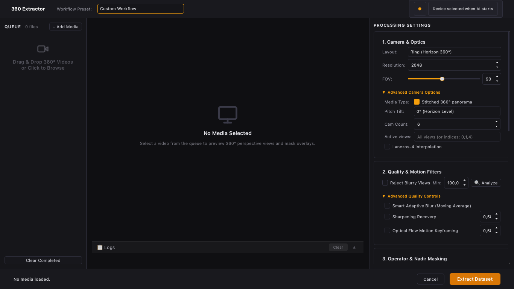

# 360 Extractor

[](https://github.com/nicolasdiolez/360Extractor/actions/workflows/ci.yml)
[](LICENSE)

Desktop and command-line preprocessing for stitched 360° panoramas and standard videos/images. Generate rectilinear views, filter blur and motion, and export segmentation masks and optional GPS metadata for reconstruction workflows.

**Development status:** this branch implements corrections from the September 2026 audit. It is not a qualified production release. See the [implementation status and remaining work](docs/implementation-2026-09-07/PROGRESSION.md). The published v3.3 release had no downloadable binaries when checked on 7 September; do not treat local `dist/` bundles as current Studio builds.



## Capabilities

- Cube, Ring and Fibonacci layouts, selectable views, FOV, pitch and output resolution.
- Flat media passthrough at native resolution with the same filtering and masking options.
- GUI and Qt-free CLI execution; settings saved separately from each job's configuration.
- YOLO segmentation with class selection, face scope, binary masks or smoothed edges. The Plants group means COCO's **potted plant**, not arbitrary vegetation.
- A nadir disc on the Cube Down view, independent of AI.
- Blur filtering, optional sharpening and motion-based selection. AI skipping currently rejects individual views.
- GPS from supported CAMM/GPMF records and GPX/SRT sidecars; explicit telemetry status and time provenance. GPS9, IMU orientation and automatic horizon leveling are not supported.
- COLMAP calibration and a portable runner that applies a virtual rig and separate masks. Reconstruction quality and compatibility with target software still require real dataset validation.

Input 360 media must already be stitched. Accepting `.insv` does not imply native double-fisheye stitching. Pixel handling currently targets 8-bit SDR; HDR, ICC and alpha workflows are not qualified.

## Install from source

Use a supported Python interpreter with its own environment. The local correction tests use Python 3.13; CI targets Python 3.11. Wider Python compatibility is not yet qualified.

```sh
python3 -m venv .venv
source .venv/bin/activate
python -m pip install --upgrade pip
python -m pip install '.[dev]' -c constraints/security-minimums.txt
python check_env.py --mode all
```

On Windows, activate `.venv\Scripts\Activate.ps1` in PowerShell instead. Install FFmpeg/ffprobe for embedded GPS and verify with `python check_env.py --telemetry`. The interactive `setup_cuda.py` helper operates only inside a virtual environment; its `--index-url` must be selected from the official PyTorch installer for the target driver. A hashed macOS arm64/Python 3.13 lock is available in `constraints/macos-arm64-py313.lock`. Windows/CUDA locks and clean-machine binary builds remain work in progress.

Standard model weights use `~/.cache/360-extractor/models` (override with `EXTRACTOR360_MODEL_DIR`). A model absent from the cache may be downloaded on first use. Provision the cache before offline use. Custom `.pt` files can execute code and require `--trust-custom-model` or `trust_custom_model: true` from an explicitly trusted source.

## Run

```sh
# Studio
python -m extractor360

# Stitched panorama or video, six cube views
360extractor --input panorama.mp4 --output out --layout cube --interval 1 --resolution 2048

# Standard media
360extractor --input video.mp4 --output out --flat

# AI and a nadir disc on the Down face
360extractor --input panorama.mp4 --output out --layout cube --ai-mask --ai-mask-cameras Down --nadir-mask

# COLMAP preparation
360extractor --input panorama.mp4 --output out --layout cube --export-colmap
```

Every run creates a new source-specific folder: `panorama_processed`, `panorama_processed_001`, and so on. Existing datasets are never silently replaced or resumed. Recursive scans exclude generated folders. `manifest.json` records `completed`, `failed` or `cancelled` with exact write counts. `images.jsonl` associates confirmed images and masks with their camera and frame.

Run `python reconstruct.py` from an exported `colmap/` folder to prepare a new workspace and invoke COLMAP. It requires a COLMAP build with native `rig_configurator` support. This pipeline follows the [COLMAP rig workflow](https://colmap.github.io/rigs.html); it has not yet been qualified through a full real reconstruction on this branch.

## Quality and metadata limits

Feather means smoothing of a binary segmentation mask, not native model probabilities. The segmentation output uses the original image dimensions through Ultralytics' [retina mask option](https://docs.ultralytics.com/modes/predict/). Precision on real operators, partial limbs, posters and tripod scenes remains to be measured.

GPS sidecars are aligned to video start by assumption. Camera heading is omitted without orientation evidence. Unknown or relative altitude is not written as sea-level altitude; only set `gps_altitude_reference: "orthometric"` after confirming the source reference. Inspect telemetry status and provenance in the manifest before relying on geotags.

## Development and documentation

```sh
QT_QPA_PLATFORM=offscreen python -m pytest -q
ruff check .
python scripts/check_release.py
```

- [Settings reference](docs/SETTINGS.md)
- [CLI reference](docs/CLI.md)
- [Actual architecture](ARCHITECTURE.md)
- [Audit](docs/audit-2026-09-07/RAPPORT.md) and [implementation plan](docs/audit-2026-09-07/PLAN.md)
- [Contributing](CONTRIBUTING.md) and [changelog](CHANGELOG.md)

Author: Nicolas Diolez. Licensed under [AGPL-3.0](LICENSE). The distribution also requires an inventory of the licenses of its bundled components.
