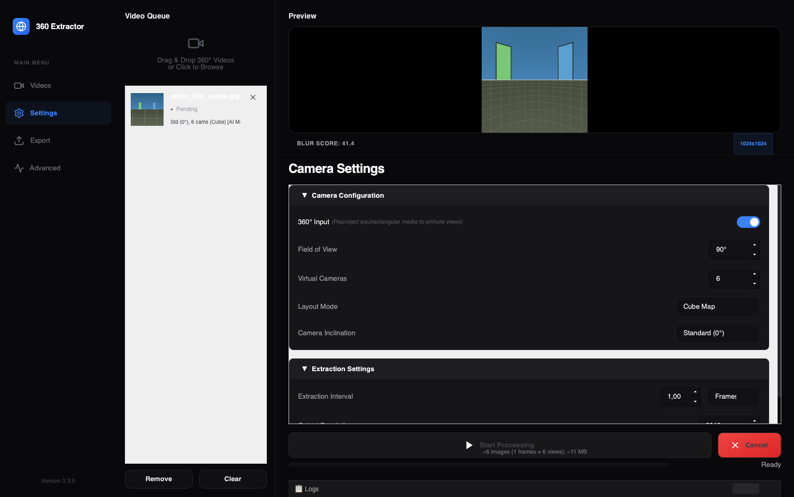

# 360 Extractor

[](https://github.com/nicolasdiolez/360Extractor/actions/workflows/ci.yml)
[](LICENSE)
[](https://www.python.org/downloads/)

High-performance desktop application and command-line tool for 360° and standard video/image preprocessing. This tool generates optimized datasets for Gaussian Splatting and photogrammetry (COLMAP, RealityScan) by converting equirectangular media into rectilinear pinhole views and removing operators using AI.

> See the [CHANGELOG](CHANGELOG.md) for what's new in each release.



## Download

Pre-built apps for **macOS (Apple Silicon)** and **Windows (x64)** are attached to each [GitHub Release](https://github.com/nicolasdiolez/360Extractor/releases) — no Python installation required.

> [!NOTE]
> The apps are not signed with an Apple Developer ID. On first launch macOS will refuse to open it: **right-click the app → Open**, then confirm (or run `xattr -dr com.apple.quarantine "/Applications/360 Extractor.app"`). You only have to do this once.

Prefer running from source? See [Installation](#installation).

## Key Features

- **360° to Rectilinear:** Reproject equirectangular video and images to pinhole views with configurable FOV and overlap.
- **Standard (Non-360) Media:** Process regular video and images as-is — every filter (blur, AI masking, sharpening, telemetry) still applies, without equirectangular reprojection.
- **Dual Interface:** Graphical UI for ease of use and CLI for automation.
- **Advanced Control:** Multiple layouts (Ring, Cube Map, Fibonacci), inclination settings, and selective camera extraction.
- **AI-Powered:** Automatic operator/object removal (supports 80 COCO classes like humans, vehicles, plants) with adjustable confidence, mask inversion, per-face masking scope, and intelligent motion-based keyframing.
- **Metadata Integration:** Extract GPS/IMU data (GoPro, Insta360, DJI) and embed into EXIF.
- **Quality Control:** Automatic blur detection, filtering, and optional **Lanczos interpolation** for maximum sharpness.
- **AI-Powered Masking:** Next-gen operator removal with **Native Softness** (probabilistic alpha blending) for seamless photogrammetry integration.

## Installation

> [!NOTE]
> **Prerequisites:** Python 3.10+ and [FFmpeg](https://ffmpeg.org) (`ffmpeg`/`ffprobe` on your PATH — required for GPS/IMU telemetry extraction).
> macOS: `brew install ffmpeg` · Windows: `winget install ffmpeg` · Linux: `sudo apt install ffmpeg`

1.  **Clone the repository**
2.  **Install dependencies:**
    - **For CPU-only or Mac (Apple Silicon):**
      ```bash
      pip install -r requirements.txt
      ```
    - **For NVIDIA GPU acceleration (Windows/Linux):**
      We provide an automated interactive setup helper that installs CUDA PyTorch and handles all dependency conflicts. Run:
      ```bash
      python setup_cuda.py
      ```

      *Or manually install by forcing both `torch` and `torchvision` together from the custom PyTorch index before installing requirements:*
      ```bash
      pip install torch torchvision --index-url https://download.pytorch.org/whl/cu124
      pip install -r requirements.txt
      ```
      > [!IMPORTANT]
      > You must install `torch` and `torchvision` **together** using the `--index-url`. If you install them separately or omit torchvision, `pip` will resolve torchvision from standard PyPI and silently downgrade your `torch` package to the CPU-only version.
3.  **Verify environment:**
    ```bash
    python3 check_env.py
    ```

## Quick Start

### GUI Mode
Launch the graphical interface for interactive processing:
```bash
python3 src/main.py
```

### CLI Mode
Process videos via command line for automation:
```bash
python3 src/main.py --input <video_path> --output <output_dir> --interval 1.0
```

Process standard (non-360) media with `--flat` (skips equirectangular reprojection):
```bash
python3 src/main.py --input <media_path> --output <output_dir> --flat
```

## Typical workflows

Starting points for the three most common capture → reconstruction pipelines. Tune the interval to your walking/driving speed (more overlap = more robust reconstruction).

### GoPro Max → RealityScan

Cube layout gives RealityScan six clean pinhole views per frame. The GPMF GPS is embedded as EXIF, the selfie stick at the nadir is masked with a disc (no AI needed), and the operator is masked by AI on the `Down` face only — so people in the scene (e.g. on posters or across the street) are not masked away on the other faces.

```bash
python3 src/main.py --input MAX_0001.mp4 --output out/max \
  --layout cube --interval 1.0 --resolution 2048 \
  --export-telemetry --nadir-mask --ai-mask --ai-mask-cameras Down \
  --naming-mode realityscan
```

### Insta360 → Postshot (3D Gaussian Splatting)

Splats want dense, sharp, redundancy-free coverage. Adaptive keyframing drops frames where nothing moved, the blur filter throws away motion-blurred frames, and the operator is masked out everywhere.

```bash
python3 src/main.py --input INSTA360.mp4 --output out/insta \
  --layout cube --interval 0.5 --resolution 2048 \
  --adaptive --ai-mask --nadir-mask \
  --format jpg --quality 95
```

### DJI → COLMAP

`--export-colmap` writes a `colmap/` folder containing the **exact** shared PINHOLE intrinsics and the per-view rig rotations, plus a turnkey `reconstruct.sh`. COLMAP no longer has to estimate the rig geometry — only the trajectory — which is faster and rejects far fewer images.

```bash
python3 src/main.py --input DJI_0001.mp4 --output out/dji \
  --layout cube --interval 1.0 \
  --export-telemetry --altitude-mode absolute \
  --export-colmap
```

## Documentation

For detailed information on configuration and usage, please refer to:

- 🖥️ **[GUI & Settings Guide](docs/SETTINGS.md)**: Detailed explanation of all processing parameters, layout modes, AI filters, and JSON configuration.
- ⌨️ **[CLI Reference](docs/CLI.md)**: Complete list of command-line arguments, flags, and automation examples.

## Contributing

Bug reports, feature requests and pull requests are welcome — see **[CONTRIBUTING.md](CONTRIBUTING.md)**.

## Author

**Nicolas Diolez**

## License

This project is licensed under the **GNU Affero General Public License v3.0 (AGPL-3.0)**.
Required by usage of YOLO26 (Ultralytics). See [LICENSE](LICENSE) for details.

## Credits

Special thanks to **Ultralytics** (YOLO26), **The Qt Company** (PySide6), and **OpenCV**.
